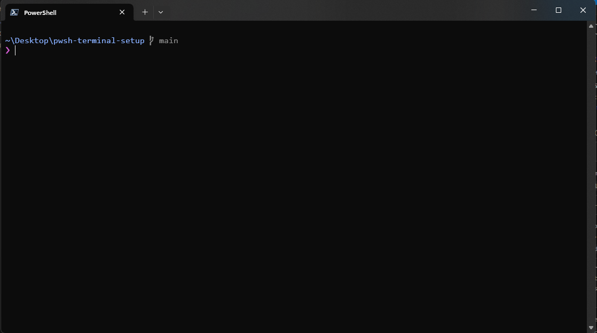
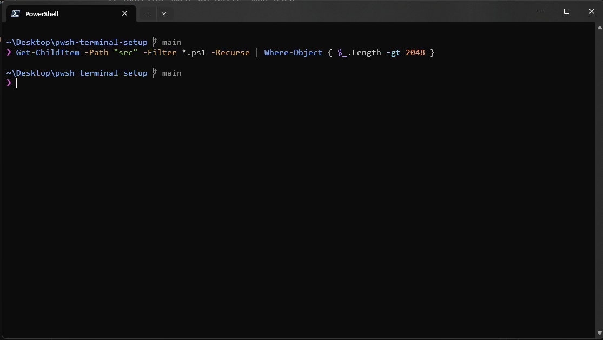
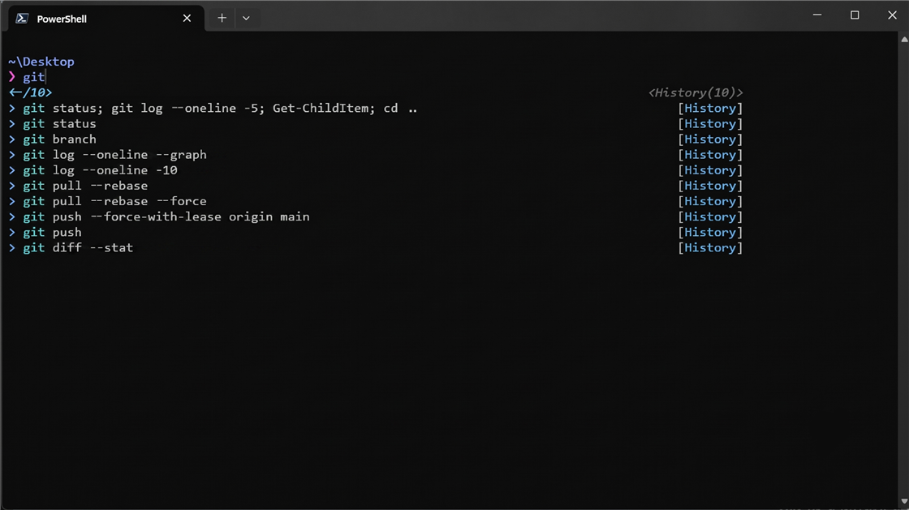
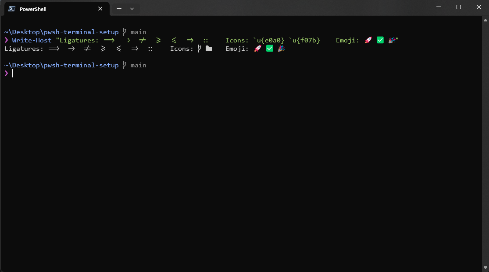

# pwsh-terminal-setup

A one-command setup for a **fast, good-looking PowerShell 7 + Windows Terminal** on Windows.

It cuts shell startup from seconds to milliseconds by lazy-loading conda, installs a font with
**both ligatures and Nerd Font icons**, adds a clean zsh-like prompt, and configures PSReadLine for
syntax highlighting, smart history, and proper word navigation — all from a single script.

## Preview

<!-- Screenshots from Windows Terminal with LigaConsolas Nerd Font on a dark theme. -->

<table>
  <tr>
    <td width="50%"></td>
    <td width="50%"></td>
  </tr>
  <tr>
    <td><b>Minimal prompt</b> — path, conda env, and git branch (with branch glyph).</td>
    <td><b>Syntax highlighting</b> — commands, parameters, strings, numbers, operators.</td>
  </tr>
  <tr>
    <td></td>
    <td></td>
  </tr>
  <tr>
    <td><b>History predictions</b> — past commands suggested as a ListView dropdown.</td>
    <td><b>Ligatures + Nerd icons</b> — <code>==&gt;</code> <code>!=</code> <code>-&gt;</code> join; branch/folder glyphs render.</td>
  </tr>
</table>

## Features

- **⚡ Fast startup** — conda is loaded on first use instead of on every launch, taking startup from
  ~2.3 s to ~0.3 s. PowerShell telemetry and the update-check banner are disabled.
- **🔤 Ligatures + icons** — installs [LigaConsolas Nerd Font](https://github.com/Dosx001/ttf-ligaconsolas-nerd-font)
  (a Consolas-style font with programming ligatures *and* Nerd Font glyphs) per-user, no admin.
- **❯ Minimal zsh-like prompt** — path, active conda env, and git branch. The branch is read straight
  from `.git/HEAD`, so rendering the prompt never spawns `git` (instant, even in big repos).
- **✨ Great editing** — PSReadLine with a dark syntax-highlighting palette, history-based predictions
  (ListView), prefix history search on ↑/↓, and `Ctrl+←/→` word jumps that actually work in Windows
  Terminal.

## Requirements

- Windows 10/11
- [PowerShell 7+](https://github.com/PowerShell/PowerShell) (`winget install --id Microsoft.PowerShell -e`)
- [Windows Terminal](https://aka.ms/terminal) (`winget install --id Microsoft.WindowsTerminal -e`)

## Install

### Option A — Installer (recommended)

1. Download the latest **`pwsh-terminal-setup-x.y.z-Setup.exe`** from the
   [Releases](https://github.com/Abdullah-Masood-05/pwsh-terminal-setup/releases) page.
2. Run it. It installs per-user (no admin needed), **bundles the font so it works offline**, and
   applies the whole setup.

> The installer is unsigned, so Windows SmartScreen may warn on first launch — click **More info →
> Run anyway**. PowerShell 7 must be installed first (the installer checks and tells you if not).

### Option B — Script

```powershell
git clone https://github.com/Abdullah-Masood-05/pwsh-terminal-setup.git
cd pwsh-terminal-setup
pwsh -ExecutionPolicy Bypass -File .\install.ps1
```

Then **restart Windows Terminal**, open a new PowerShell tab, and verify:

```powershell
Write-Host "Icons: `u{e0a0}  `u{f07b}   Ligatures: ==> -> != >= <=   Emoji: 🚀 ✅"
```

You should see the branch/folder icons, joined operators, and color emoji. Try `Ctrl+←` / `Ctrl+→`
to jump word-by-word.

### Options

```powershell
.\install.ps1 -SkipFont          # don't touch fonts
.\install.ps1 -SkipTerminal      # don't patch Windows Terminal settings
.\install.ps1 -FontFamily "Your Font Name"
```

## What the installer does

| Step | Action | Safety |
|------|--------|--------|
| 1 | Sets `POWERSHELL_TELEMETRY_OPTOUT` and `POWERSHELL_UPDATECHECK` at **User** scope | env vars only |
| 2 | Downloads + installs LigaConsolas Nerd Font (per-user, registered in HKCU) | reads the family name via .NET |
| 3 | Writes the profile to `$PROFILE.CurrentUserAllHosts` | backs up to `profile.ps1.bak`; merges idempotently |
| 4 | Sets the font on Windows Terminal `profiles.defaults` and frees `Ctrl+←/→` | backs up `settings.json.bak`; JSON validated |
| 5 | Measures startup and confirms conda is a lazy placeholder | — |

Everything is **idempotent** (safe to re-run) and **portable** (paths resolved dynamically; conda is
auto-detected across anaconda3 / miniconda3 / miniforge3 / PATH).

## The profile

[`profile.ps1`](profile.ps1) is the whole configuration and is readable on its own. It's organized
into four `#region` blocks: `startup-env`, `conda lazy-init`, `prompt`, and `PSReadLine`. The
installer merges these blocks into your existing profile without disturbing anything else.

## Windows Terminal

The installer patches your `settings.json` directly. If you'd rather apply it by hand, see
[`windows-terminal/settings.partial.jsonc`](windows-terminal/settings.partial.jsonc) for just the
font and keybinding fragments.

> **Note on `Ctrl+←/→`:** word navigation needs two layers — Windows Terminal must *not* capture the
> keys (the unbinds), and PSReadLine must bind them (done in the profile). The unbinds use the current
> `{ "id": null }` schema; the older `{ "command": "unbound" }` form makes Windows Terminal rewrite
> `settings.json` on every launch and can throw a "could not write settings" error.

## Uninstall / restore

The installer never deletes — it backs up. To revert:

```powershell
Copy-Item "$($PROFILE.CurrentUserAllHosts).bak" $PROFILE.CurrentUserAllHosts -Force
# and restore settings.json from its .bak next to the original
```

## Credits

- Font: [Dosx001/ttf-ligaconsolas-nerd-font](https://github.com/Dosx001/ttf-ligaconsolas-nerd-font)
- Prompt style inspired by [Pure](https://github.com/sindresorhus/pure); palette by
  [Tokyo Night](https://github.com/folke/tokyonight.nvim).

## License

[MIT](LICENSE)
